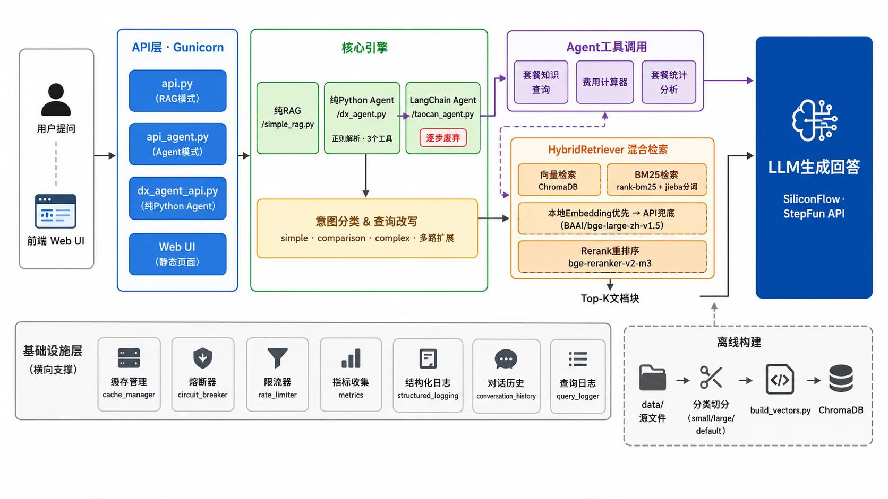
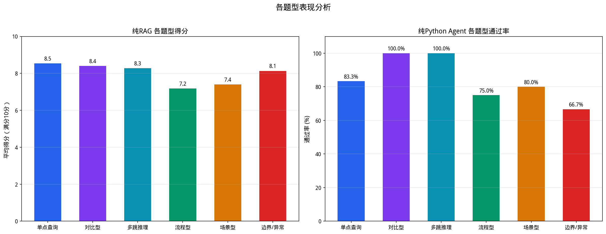
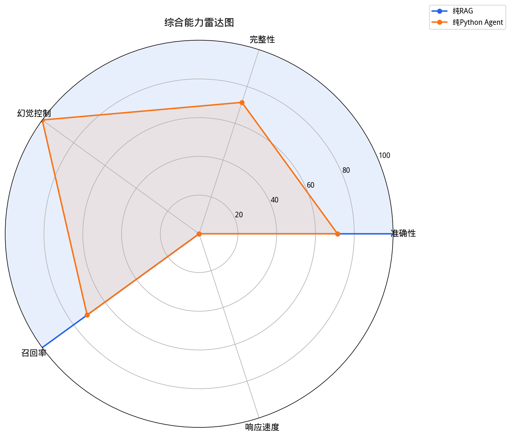
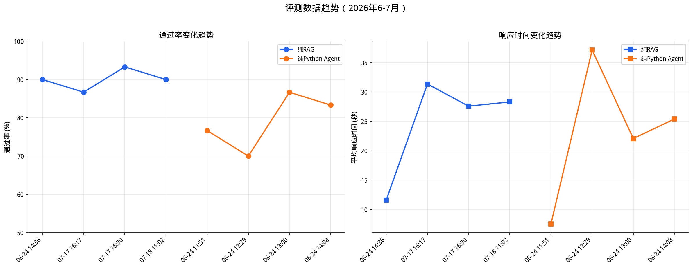
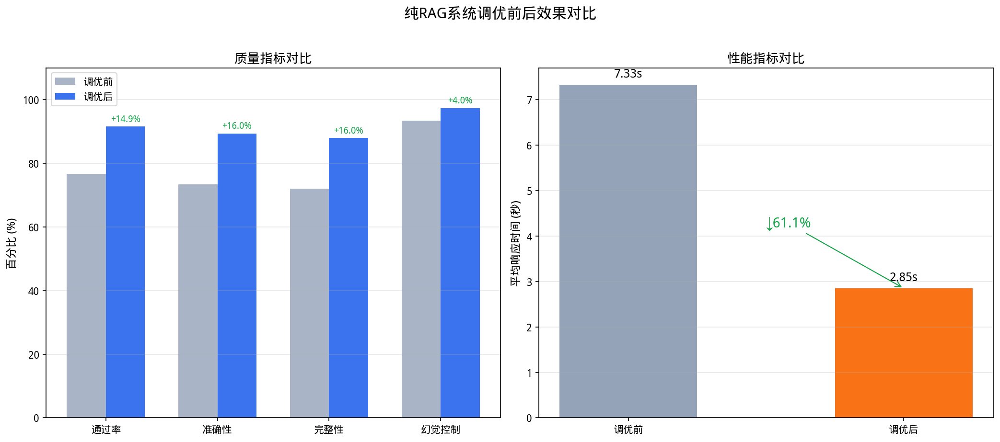
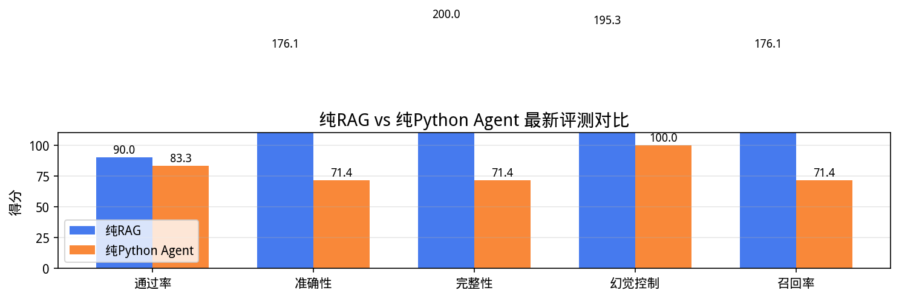

# RAG Agent System

纯Python RAG + Agent系统，支持知识库问答、工具调用、费用计算。正在逐步去除LangChain依赖。

> ⚠️ **评测说明**：本项目评测题目来自向量数据库中的已有内容（开卷考试），系统从知识库中检索到相关文档后作答。因此准确率、召回率等指标较高，不代表系统在面对未知问题时也能达到同样效果。实际生产环境中，用户问题与知识库内容的匹配度会有所下降。

## 📐 系统架构



### 流程说明

```
用户提问 → 前端 Web UI → API层（RAG/Agent/纯Python三种模式）
  → 意图分类 & 查询改写（simple/comparison/complex）
  → 混合检索（向量检索 + BM25 + 本地Embedding + Rerank）
  → LLM 生成回答
```

**Agent 工具调用**：dx_agent.py 通过正则解析 LLM 输出，调用3个工具：
- 套餐知识查询（RAG检索）
- 费用计算器（本地计算）
- 套餐统计分析（数据分析）

**离线构建**：源文件 → 分类切分（small/large/default） → build_vectors.py → ChromaDB

**基础设施**：缓存管理、熔断器、限流器、指标收集、结构化日志、对话历史、查询日志

## 🔪 文档切分策略

采用 **分类型切分（Profile-based Chunking）**，根据文件类型自动选择切分参数。

### 三档 Profile

| Profile | chunk_size | chunk_overlap | 适用内容 | 匹配规则 |
|---------|-----------|--------------|---------|---------|
| **small** | 250 | 50 | 短问答对 | 文件名含 `Q&A`、`qa_plans`、`transfer_faq` |
| **large** | 500 | 100 | 结构化详情 | 文件名含 `套餐详情`、`plan_details`、`套餐搭配表` |
| **default** | 300 | 60 | 流程/通用文档 | 未匹配到任何规则 |

### 切分流程

```
data/
├── *.txt, *.md  ──→ TextLoader ──→ 按文件名匹配 profile ──→ RecursiveCharacterTextSplitter
│                                                                         │
│   套餐详情_整理版.md  ──→ [large]  (500/100) ──→ splitter ──→ chunks ──┤
│   套餐搭配，Q&A.md    ──→ [small]  (250/50)  ──→ splitter ──→ chunks ──┤
│   crm_process.md      ──→ [default](300/60)  ──→ splitter ──→ chunks ──┤
│                                                                         │
│                                                    ┌────────────────────┘
│                                                    ▼
│                                              合并超短 chunk
│                                              (< 100 字 → 与前一个合并)
│                                                    │
├── *.jsonl ──→ 逐行解析 ──→ 标记 source_type=jsonl ─┤  (跳过切分，每行一个文档)
├── *.csv   ──→ DictReader ──→ 标记 source_type=csv  ─┤  (跳过切分，每行一个文档)
│                                                    │
│                                                    ▼
└─────────────────────────────────────────→ texts[] ──→ ChromaDB
```

### 分隔符优先级

| 优先级 | 分隔符 | 作用 |
|--------|--------|------|
| 1 | `\n\n` | 段落分隔 |
| 2-4 | `###` / `####` / `#####` | Markdown标题 |
| 5 | `\n` | 换行 |
| 6-8 | `。` / `！` / `？` / `；` | 句末标点 |
| 9 | `，` | 逗号 |
| 10 | ` ` | 空格 |

> 设计要点：`###` 排在 `\n` 之前，确保 Markdown 标题行作为优先切分点，保留「标题→内容」的语义完整性。

### 特殊处理

- **JSONL**：每行已是独立语义单元（问答对/结构化记录），跳过切分，直接作为 Document
- **CSV**：每行转为 `"key1：value1，key2：value2"` 格式，直接作为 Document
- **超短块合并**：< 100 字的 chunk 与前一个合并，避免碎片化

## 🔍 检索路由

### 混合检索（Hybrid Search）

```
用户查询
  │
  ├──→ 向量检索（ChromaDB）──→ Top-N 语义相似文档
  │
  └──→ BM25 检索（rank-bm25）──→ Top-N 关键词匹配文档
          │
          └──→ 合并去重 ──→ Rerank 重排序 ──→ Top-K 最终文档
```

- **向量检索**：使用 BAAI/bge-large-zh-v1.5 Embedding，捕捉语义相似性
- **BM25 检索**：基于 jieba 分词的关键词匹配，擅长精确词汇命中
- **Rerank 重排序**：使用 BAAI/bge-reranker-v2-m3 对合并结果重新打分，选出最终 Top-K

### 查询改写 & 意图分类

```
原始查询 ──→ 意图分类 ──→ 查询改写 ──→ 多路检索
                │
                ├── simple（事实查询）：直接检索
                ├── comparison（对比查询）：拆分为多个子查询并行检索
                └── complex（复杂查询）：扩展同义查询，多路召回
```

### Agent 工具调用（dx_agent.py）

```
用户提问 ──→ LLM 生成回答 ──→ 正则解析工具调用 ──→ 执行工具 ──→ 返回结果
                                   │
                                   ├── 套餐知识查询（RAG检索）
                                   ├── 费用计算器（本地计算）
                                   └── 套餐统计（数据分析）
```

## 📁 项目结构

```
rag-agent-system/
│
├── core/                        # 核心业务（RAG/Agent引擎）
│   ├── simple_rag.py            #   纯RAG（向量+BM25+Rerank）
│   ├── dx_agent.py              #   纯Python Agent
│   ├── taocan_agent.py          #   LangChain Agent（逐步废弃）
│   ├── simple_rag_lite.py       #   RAG精简版
│   ├── simple_rag_improvements.py #  RAG改进版
│   └── workflow_langchain.py    #   LangChain工作流（旧）
│
├── api/                         # API服务层
│   ├── api.py                   #   FastAPI（RAG模式）
│   ├── api_agent.py             #   FastAPI（Agent模式）
│   ├── dx_agent_api.py          #   FastAPI（纯Python Agent）
│   ├── gunicorn.conf.py         #   Gunicorn配置
│   └── start.sh                 #   启动脚本
│
├── vector/                      # 向量库/Embedding
│   ├── build_vectors.py         #   向量库构建（含切分逻辑）
│   └── local_embeddings.py      #   本地Embedding（优先本地，API兜底）
│
├── infra/                       # 基础设施（通用组件）
│   ├── config.py                #   系统配置（含切分参数）
│   ├── config_manager.py        #   配置管理器
│   ├── cache_manager.py         #   缓存管理
│   ├── conversation_history.py  #   对话历史
│   ├── circuit_breaker.py       #   熔断器
│   ├── rate_limiter.py          #   限流器
│   ├── metrics.py               #   指标收集
│   ├── query_logger.py          #   查询日志
│   └── structured_logging.py    #   结构化日志
│
├── extensions/                  # 扩展功能
│   └── voice/                   #   语音模块
│
├── evaluation/                  # 评测
│   ├── scripts/                 #   评测脚本
│   ├── results/                 #   评测结果JSON
│   ├── reports/                 #   评测报告
│   ├── tests/                   #   测试脚本 & 题库
│   └── tools/                   #   压测/调试工具
│
├── static/                      # Web UI
├── docs/                        # 文档 & 评测图表
│
├── requirements.txt             # 完整依赖
├── requirements_pure.txt        # 精简依赖（无LangChain）
├── .env.example                 # 环境变量示例
└── visualize_eval.py            # 评测数据可视化
```

## 🚀 快速开始

```bash
# 安装依赖
python3 -m venv venv && source venv/bin/activate
pip install -r requirements.txt        # 完整版
pip install -r requirements_pure.txt   # 精简版（纯Python Agent）

# 配置
cp .env.example .env
# 编辑 .env 填入API密钥

# 构建向量库（含切分 + Embedding）
python vector/build_vectors.py --force

# 启动
python api/api.py              # RAG模式
python api/api_agent.py        # Agent模式
python api/dx_agent_api.py     # 纯Python Agent模式

# 命令行测试
python core/simple_rag.py "有哪些套餐？"
python core/dx_agent.py "59元套餐多少流量？"
```

## 📊 评测数据可视化

> ⚠️ 以下评测数据基于向量库中已有内容出题（开卷），系统检索到相关文档后作答。
> 高准确率反映的是"检索 + 生成"链路的工程质量，不代表对未知问题的泛化能力。

### 各题型表现


### 综合能力雷达图


### 通过率 & 响应时间趋势


### 调优前后效果对比


### 纯RAG vs 纯Python Agent 对比


## 🐛 常见问题

**Q: 启动时报错"SILICONFLOW_API_KEY未设置"**
A: 确保`.env`文件已填入有效的API密钥。

**Q: 查询返回"向量库未初始化"**
A: 运行`python vector/build_vectors.py --force`构建向量库。

**Q: 响应时间太长**
A: 检查LLM模型配置，启用缓存，检查网络连接。

## 📜 许可证

MIT

---

*最后更新：2026年8月31日*
